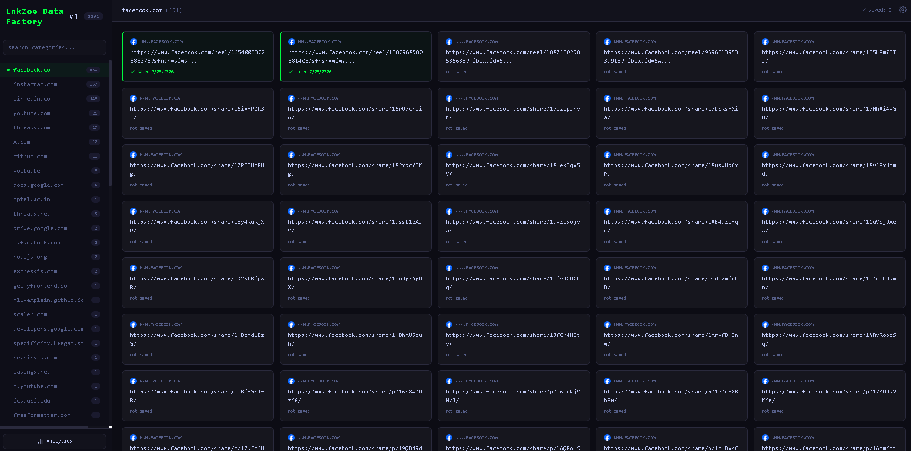
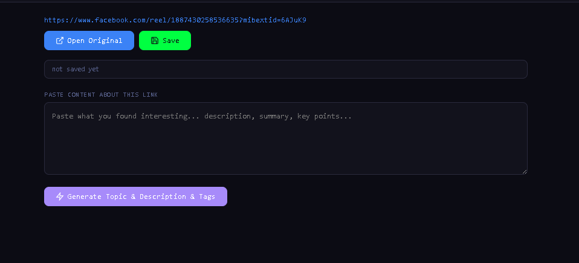
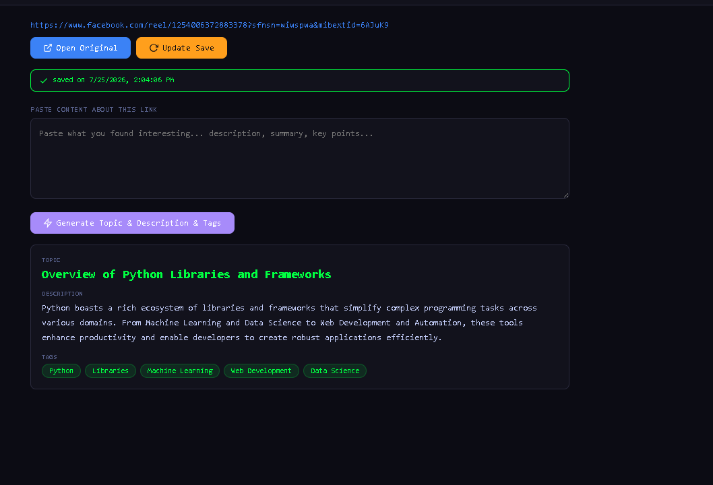
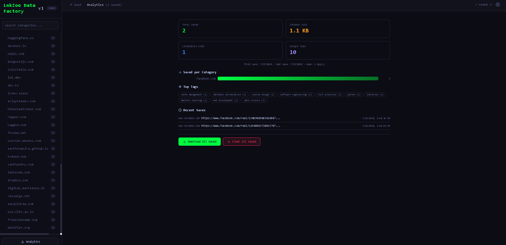
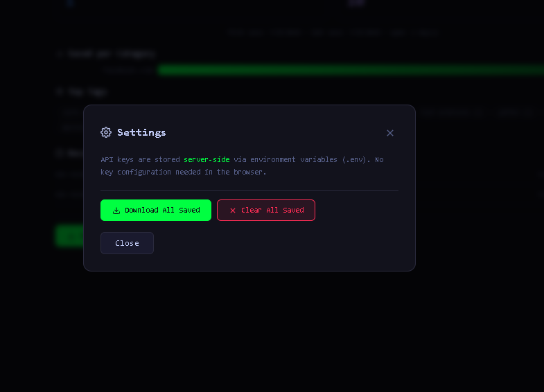

# LnkZoo Data Factory

Data preparation and AI enrichment pipeline for [LnkZoo](https://github.com/Sayantan-B-dev/Ex_LnkZoo_data_factory). Processes 1107+ categorized links with AI-generated topics, descriptions, and tags via OpenRouter. All saved data synced to Supabase — accessible from any device.

## Features

- **1107 links** across 73 domains and 28 categories
- **AI enrichment** — paste content about a link, generate topic/description/tags via GPT-4o-mini
- **3-key rotation** — rotates through OpenRouter API keys with 429 backoff
- **Multi-device sync** — all data stored in Supabase, consistent across browsers and machines
- **Dead link flagging** — mark broken/unavailable links, synced via Supabase, visible across devices
- **Status filters** — filter cards by All / Done / Dead / Not Done per category
- **Analytics dashboard** — stat cards, 3 pie charts (Saved vs Dead, Dead by Domain, Domain Completion), stacked progress bars, tag cloud, recent activity
- **Category completion** — sidebar turns green when all links in a domain are processed
- **Loading screen** — smooth loading bar + spinner while data fetches from Supabase
- **Search & filter** — search categories in sidebar, green dots show categories with saved entries
- **Prev/Next navigation** — browse links sequentially in detail view
- **Export** — download all saved data (including dead flags) as JSON
- **WhatsApp import** — paste chat export in Settings to generate `links-categorized.json`
- **Terminal-themed UI** — cyber/terminal aesthetic with responsive sidebar

## Prerequisites

- Node.js 18+
- OpenRouter API key(s) — get at [openrouter.ai/keys](https://openrouter.ai/keys)
- Supabase project — create at [supabase.com](https://supabase.com)

## Setup

```bash
cd _data
npm install
```

Create `.env` in `_data/` (copy from `.env.example`):

```env
# Supabase
NEXT_PUBLIC_SUPABASE_URL=https://your-project.supabase.co
NEXT_PUBLIC_SUPABASE_ANON_KEY=sb_publishable_...
SUPABASE_SERVICE_KEY=sb_secret_...

# OpenRouter
OPENROUTER_API_KEY_1=sk-or-v1-...
OPENROUTER_API_KEY_2=sk-or-v1-...
OPENROUTER_API_KEY_3=sk-or-v1-...
```

At least one OpenRouter key is required. Keys are used server-side only — never exposed to the browser.

### Database setup

In your [Supabase dashboard](https://supabase.com/dashboard) → **SQL Editor**, run:

```sql
create table saved_links (
  id uuid primary key default gen_random_uuid(),
  url text unique not null,
  topic text default '',
  description text default '',
  tags jsonb default '[]',
  saved_at timestamptz not null,
  dead boolean default false,
  flagged_at text,
  created_at timestamptz default now()
);
```

## Development

```bash
npm run dev
```

Opens at [http://localhost:3000](http://localhost:3000).

## Build

```bash
npm run build
npm start
```

## Screenshots

| Home | Link Detail | After Generate | Analytics | Settings |
|---|---|---|---|---|
|  |  |  |  |  |

## Usage

1. Open the app — sidebar lists all 28 categories sorted by link count
2. Click a category to see its links in the card grid
3. Use the filter bar (All / Done / Dead / Not Done) to narrow cards by status
4. Click a card to open the detail view
5. Paste content about the link in the textarea
6. Click **Generate** — AI returns topic, description, and tags, auto-saves to Supabase
7. If a link is broken, click **Flag Dead** — dead links sync across devices
8. Click **Analytics** in sidebar or the saved count badge for stats with pie charts
9. Use **Settings** (gear icon) — export saved data, import WhatsApp chat to generate links JSON

### WhatsApp Import

Paste a WhatsApp chat export into **Settings → Import WhatsApp Chat**, click **Parse URLs**, then download the generated `links-categorized.json`. You can also use the CLI:

```bash
node scripts/parse-chat.mjs "WhatsApp Chat with AllLinksMain.txt"
```

Both methods extract all URLs, group by domain, and output the same JSON structure.

### Saved data

- Each entry stores `{ topic, description, tags[], savedAt }` keyed by URL
- Dead flags add `{ dead: true, flaggedAt }` to the same entry
- Stored in Supabase `saved_links` table, synced across all devices
- Exported as JSON via Settings or Analytics page (includes dead flags)

## Project Structure

```
_data/
├── app/
│   ├── api/generate/route.js     — OpenRouter proxy (server-side keys)
│   ├── api/saved/route.js        — Supabase CRUD (incl. dead flag support)
│   ├── layout.js                 — Root layout & metadata
│   ├── page.js                   — Main UI (React client component)
│   ├── globals.css               — Cyber/terminal theme
│   ├── not-found.js              — Custom 404 page
│   ├── error.js                  — Client error boundary
│   └── global-error.js           — Root error boundary
├── lib/
│   └── supabase.js               — Supabase server client
├── scripts/
│   └── parse-chat.mjs            — CLI tool to parse WhatsApp export → links JSON
├── links-categorized.json        — 1107 links, 73 domains, 28 categories
├── .env                          — API keys & secrets (gitignored)
├── .env.example                  — Environment variable template
├── next.config.mjs               — Next.js config
└── package.json
```

## Tech Stack

- **Next.js 14** (App Router)
- **React 18**
- **Supabase** — PostgreSQL backend with auto-sync across devices
- **OpenRouter** — GPT-4o-mini for AI enrichment
